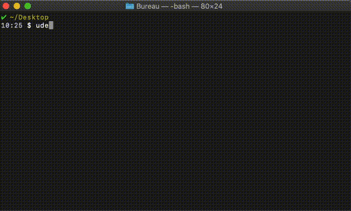

# A backup tool for Udemy contents

In a nutshell, `udemy-backup` downloads videos and related assets, and store them all in a folder for offline consumption.



## Getting Started

The tool is a go binary, you can install it using `go get`:

```sh
$ go get -u github.com/ushu/udemy-backup
```

and then use the tool to perform backups:

```sh
$ udemy-backup backup
```

### Setup for development

Clone the repo and use go [`dep`](https://github.com/golang/dep) to fetch dependencies:

```sh
# clone the project into your GOPATH, then:
$ go get
```

to run the updated version 

```sh
# clone the project into your GOPATH, then:
$ go run .
```

and to install your development version locally

```sh
# clone the project into your GOPATH, then:
$ go install .
```

## Usage

Enter your Udemy credentials and follow the instructions:

```sh
$ udemy-backup 
Email: xxx@gmail.com
Password: •••••••
```

#### Re-downloading elements

By default, `udemy-backup` will skip already-downloaded files. To force a re-download of all the assets, one can do:

```sh
$ udemy-backup -r
```

#### Download all the courses

The `-a` flag triggers a backup for all the course associated with the account:

```sh
$ udemy-backup -a
```

## Contributing

PR are welcome anytime, please consult the **TODO** section below for a basic roadmap, or feel free to add any funcionality you might feel necessary.

## License

This project is licensed under the MIT License - see the [LICENSE](LICENSE) file for details

## TODO

* [ ] Add backup for slides
* [ ] Add backup for quiz
* [ ] Improve error handling (right now any error fails the whole process)
